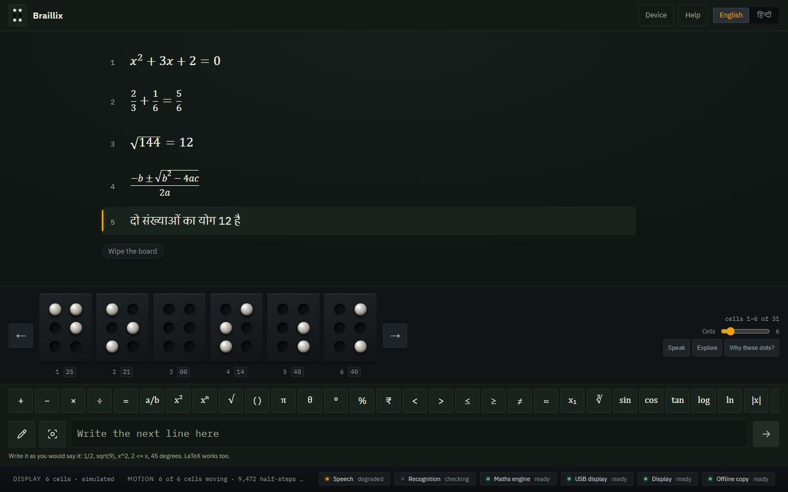
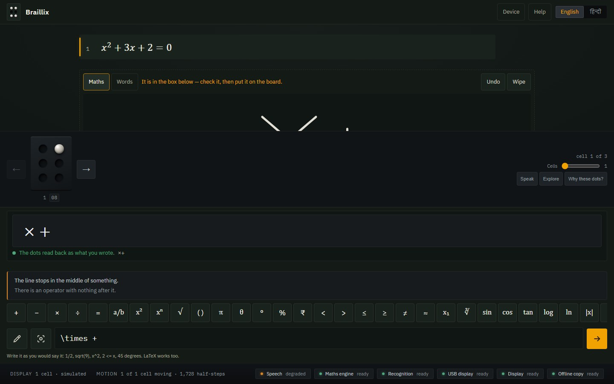
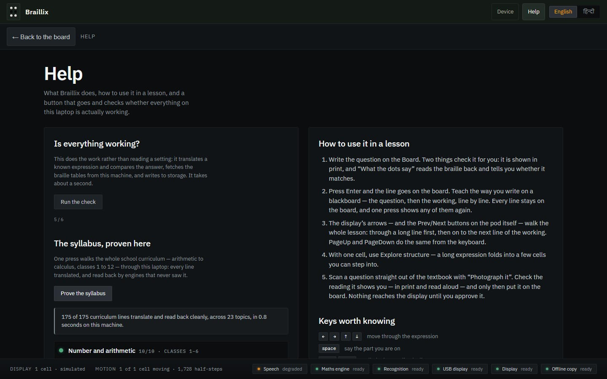

# Braillix — the teacher's blackboard, on a blind child's fingers

A maths teacher who only knows WhatsApp opens one screen that **is** a blackboard: she writes
by hand, types, or photographs whatever she is teaching *right now* — full questions, worded
problems, worked steps — and it lands on her student's refreshable braille cells, live and
verified. In English and in Hindi. With no account, no server, no API key, and no network
needed after the first load.

**Live:** https://braillix.vercel.app

This repository is the **software half** of the Braillix capstone. The hardware half (the
ESP32 "brain pod" and the motorised "muscle cells") lives with the hardware team; this app
drives it over the wire protocol in `docs/PROTOCOL.md`, and is complete without it.

## The team

Braillix is a capstone project built by:

- **Shaurya Verma** — Software
- **Harshita** — Software
- **Aniket** — Software
- **Atishay** — Hardware
- **Mridul** — Hardware

## What it looks like

<p align="center">
  
</p>

<p align="center">
  
</p>

<p align="center">
  
</p>

## What a lesson looks like

The whole app is one surface: the lesson standing on the board as typeset chalk, the cells
beneath it, and a chalk tray with every symbol a school line needs always on screen.

1. **Write it — like chalk.** Press the pencil and the board's next line becomes a writing
   surface. Write a step with a finger, stylus or mouse; the moment the hand pauses, the
   on-device recogniser reads it into the box below, with a print preview and a braille
   verdict to check. One press puts it on the board — and the teacher's own handwriting
   stays faintly behind the typeset line.
2. **Type it — like a message.** `2x + 3 = 11`, `sqrt(144)`, `1/2`, or a full Hindi question
   like `दो संख्याओं का योग 12 है` — Enter puts it on the board, on the cells, and in the
   room aloud. The print preview and the dots track every keystroke.
3. **Photograph it.** The camera grip reads an equation photo, or a full textbook question
   part by part — words by Tesseract (English + Hindi), maths by a 76 MB on-device formula
   model. Everything is read **on the laptop**, offline; nothing leaves the room.
4. **The walk.** The pod's own Prev/Next buttons — or PageUp/PageDown, or the on-screen
   arrows — walk the whole lesson: through the panes of a long line, then on to the next
   line. On a one-cell display that walk is seamless; on forty cells it is the same walk.

## Why every dot can be trusted

- **Nothing recognised reaches the display without a human.** A recognised line cannot even
  be *represented* as unconfirmed in the lesson store — the confirm gate is a TypeScript
  type, tested with `@ts-expect-error`.
- **Three independent proofs per expression:** Nemeth output from speech-rule-engine over
  temml MathML; golden vectors checked against published tables; and a hand-rolled
  **readback engine** that reconstructs the meaning from the dots alone — engines that never
  saw the input — shown to the teacher as "MATCHES WHAT YOU TYPED".
- **Uncertainty is said out loud.** Low-confidence scan parts are flagged "not sure — check
  this"; a failed translation falls back to literal braille and says so; every optional
  capability (recognition, speech, USB, pod, offline copy) publishes state · reason · fix.
- **The build refuses to ship blind.** `app/scripts/assert-assets.mjs` fails the build if
  the recognition model, the OCR language files, or the Nemeth tables are missing from the
  artifact — a dead button is a build error, not a discovery.
- **The syllabus is proven live, by anyone.** Help → "Prove the syllabus" walks all 175
  curriculum lines (arithmetic to calculus, classes 1–12) through the real pipeline in the
  browser and reads each back — 175/175 clean in under a second on the live site. The same evidence on paper is
  `docs/ACCURACY.md`, regenerated by `npm run accuracy`.
- **Scanning is fast enough to teach with.** Both recognisers warm in the background at app
  start (the badge says so); press-to-result measured at ~1.25 s, where the cold path used
  to cost 64 s.

## The codes

Mathematics is **Nemeth** (the code Indian maths braille derives from); surrounding words
are **Grade-1 literary braille** in English and **Bharati Braille** for Hindi — one line can
carry all of them, with the boundary indicators emitted by the translator. Sources for both
tables are cited inline in `app/src/core/`.

## Hardware, discovered never assumed

The cell count comes from an I2C scan reported by the pod (`GET /chain`) — the software has
no literal cell count anywhere, including the simulator. One `Transport` interface, three
implementations (simulator, Web Serial USB, Wi-Fi pods), one shared conformance test suite.
`npm run pod` starts a zero-dependency virtual pod that speaks the entire protocol —
including nav buttons and multi-pod layout — so integration day starts from working, not
from hope. Cam bit order, cell direction and home position are runtime configuration with a
ten-second calibration screen, because the handoff document flags them as the likeliest
mismatch.

## Run it

```bash
npm install          # also copies SRE + tesseract assets into app/public
npm run fetch:model  # once: the 76 MB on-device formula model
node tools/fetch-tesseract-langs.mjs   # once: eng+hin word reading (3 MB)
npm run dev          # http://localhost:5173
npm run verify       # typecheck · lint · 666 unit tests · 101 e2e journeys + screenshots
npm run pod          # a virtual brain pod on :8080 — connect from the Device screen
```

Everything is self-hosted: fonts, Nemeth tables, both recognition engines. After the first
visit the service worker keeps the whole app working with the Wi-Fi unplugged.

## The evidence trail

- `docs/REPORT.md` — the full project report source: problem statement, stack, architecture,
  models, measured results, honest limitations
- `docs/ACCURACY.md` — all 175 curriculum lines with their braille and read-back verdicts
- `docs/PROTOCOL.md` — the hardware wire protocol, matched by `tools/virtual-pod`
- `ARCHITECTURE.md` — state authority, choke points, failure modes, stack lock
- `docs/shots/` — what it actually looks like, captured from the live site
