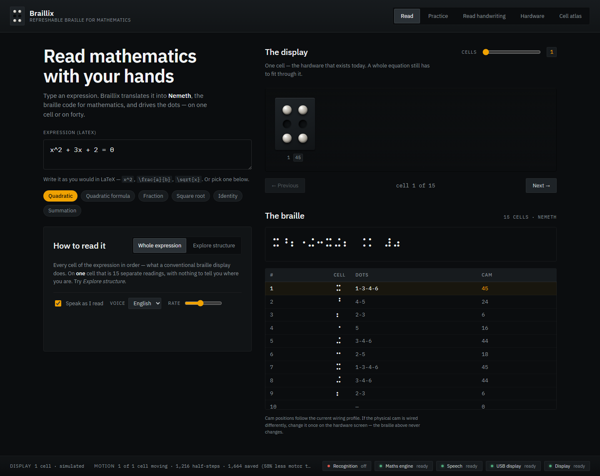
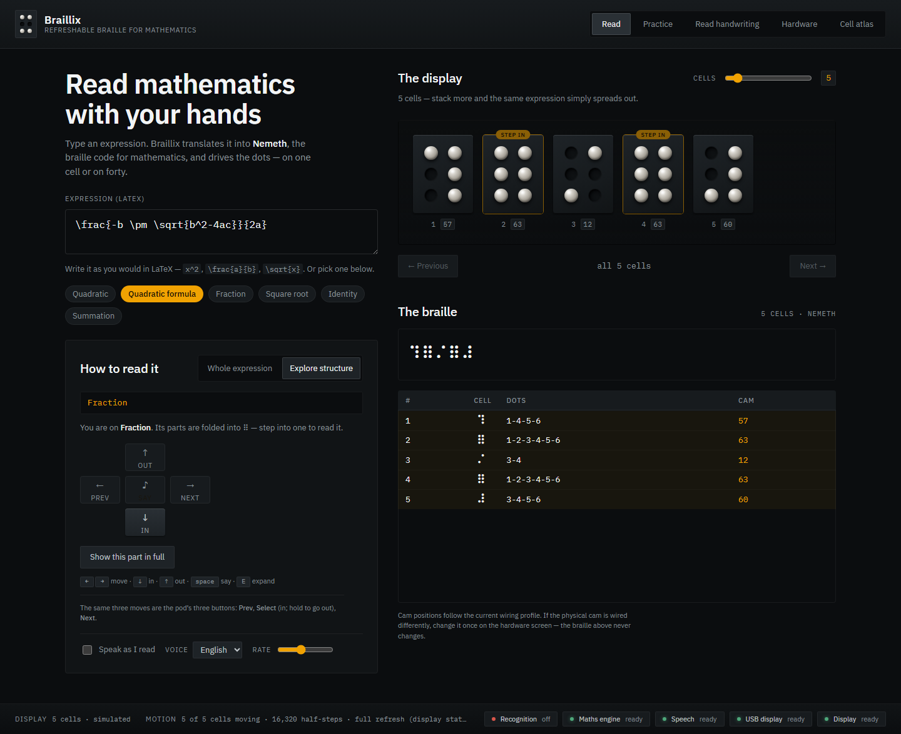
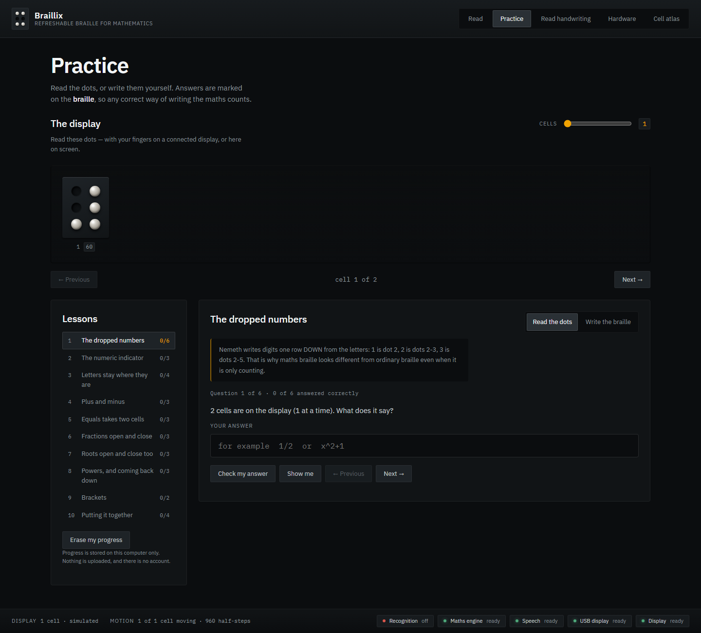
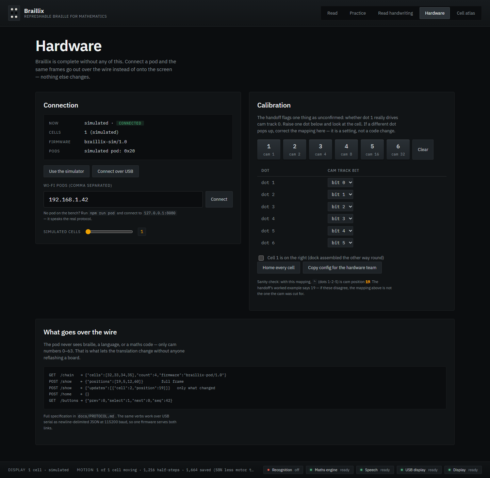
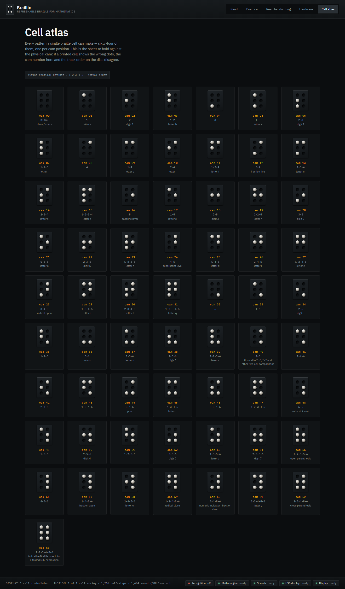

<div align="center">

# Braillix

**Read mathematics with your hands.**

A refreshable braille display for maths, built cheap enough to reach Indian schools for the blind.
This repository is the **software half** — everything from *"here is an equation"* to
*"the right dots are raised on the right cells."*

</div>

---

## Run it

```bash
npm install
npm run dev
```

That is the whole setup. No server, no Python, no API key, no account, no internet.

> **It works with nothing plugged in.** That is not a fallback mode — it is the point. The display
> is simulated on screen, pixel-accurate to the hardware, and every cam number you see is the exact
> byte that would travel down the I2C bus to a real muscle cell.

Optional, when you want the camera to read handwriting:

```bash
npm run fetch:model     # one-time ~80 MB download, then fully offline forever
```

## What it does

**Type an equation → the dots move.** LaTeX in, [Nemeth](https://www.brailleauthority.org/nemeth)
out — the braille code mathematics is actually written in, with its dropped digits, its fraction
and radical indicators, and its superscript levels. Not a letter-for-letter transliteration.

**Any number of cells. One, two, forty.** The hardware team is building one cell now and will stack
more later. There is no cell count written anywhere in this codebase — it is discovered from
whatever is connected, and a test fails the build if anyone tries to hardcode one.

**Photograph handwritten maths → the dots move.** A vision model runs *in your browser*, offline,
in about a second. The result always lands in an editable field, because recognition that cannot be
corrected is recognition you cannot trust.

**Learn, practise, get feedback** — braille-first, with answers entered in six-key braille rather
than picked from a list.


---

## What it looks like

| | |
|---|---|
| **Read** — one cell, a whole quadratic, and the cam number for every dot |  |
| **Explore structure** — the quadratic formula folded to five cells, ⠹ ⠿ ⠌ ⠿ ⠼ |  |
| **Practice** — braille-first drills, answers written in six-key Perkins entry |  |
| **Hardware** — the discovered chain, and the cam calibration that de-risks demo day |  |
| **Cell atlas** — all 64 cam positions, printable, for holding against the physical cam |  |

## Why it is built this way

The school we took the prototype to told us something specific: reading a whole expression through
a single cell is very difficult. That is not a complaint about cell count — it is a statement about
structure. Mathematics is a tree; print draws that tree in two dimensions; braille flattens it into
one; a single cell flattens it again, into time. Every flattening throws away the shape.

So Braillix does not try to stream characters faster. It gives the structure back: you walk the
expression as a tree — this fraction, its numerator, the thing under that root — folding whole
sub-expressions into a single ⠿ cell you can step over or step into, while your ear hears exactly
what your finger is touching, in English or in Hindi.

## The hardware seam

The laptop is the brain; the ESP32 pod is a messenger; each muscle cell just goes to a cam
position. Braillix speaks that protocol three ways — a simulator, USB (Web Serial), and Wi-Fi to a
real pod — behind one interface, plus a protocol-accurate emulator so integration can be *tested*
rather than hoped for. The cam bit order the handoff flags as unconfirmed is a runtime setting with
a calibration screen, not a constant: if the physical cam disagrees with the maths, it is a
ten-second fix, not a re-flash.

See [`docs/PROTOCOL.md`](docs/PROTOCOL.md) and the printable
**Cell Atlas** in the app — all 64 cam positions, their dots, and their Nemeth meaning, on one
sheet you can hold against the physical cam.

## Verify it

```bash
npm run verify     # typecheck · lint · unit tests · headless journey + screenshots
```

The unit suite includes golden Nemeth expressions, every letter and digit cross-checked against the
translation engine, and structural invariants that fail the build if a cell count gets hardcoded or
hardware bit arithmetic escapes its one permitted file.

## Repository map

| Path | What lives there |
|---|---|
| `app/src/core/` | The pure engine — LaTeX → Nemeth → dots → cam → frame. No React, no I/O. |
| `app/src/ui/` | Screens and components. One design-token source in `tokens.css`. |
| `app/src/transport/` | Simulator · Web Serial · Wi-Fi pod, behind one interface. |
| `firmware/` | ESP32 pod and muscle-cell sketches, written to the same protocol. |
| `tools/` | The virtual pod emulator, and the model fetcher. |
| `docs/` | The hardware handoff, the wire protocol, the integration notes. |

Demo runbook: [`docs/DEMO.md`](docs/DEMO.md) — seven minutes, with what to say.

Project documents: [`CLAUDE.md`](CLAUDE.md) (the rules) · [`ARCHITECTURE.md`](ARCHITECTURE.md) ·
[`RESEARCH.md`](RESEARCH.md) · [`DECISIONS.md`](DECISIONS.md) · [`ARC_PLAN.md`](ARC_PLAN.md) ·
[`PROGRESS.md`](PROGRESS.md) · [`THIRD_PARTY.md`](THIRD_PARTY.md)

## Credit where it is due

Braillix stands on [speech-rule-engine](https://github.com/speech-rule-engine/speech-rule-engine),
[Temml](https://github.com/ronkok/Temml), [Transformers.js](https://github.com/huggingface/transformers.js)
and [FormulaNet](https://huggingface.co/alephpi/FormulaNet). Full attribution and licences in
[`THIRD_PARTY.md`](THIRD_PARTY.md).

Software by **Shaurya Verma**. Hardware by the Braillix team.
